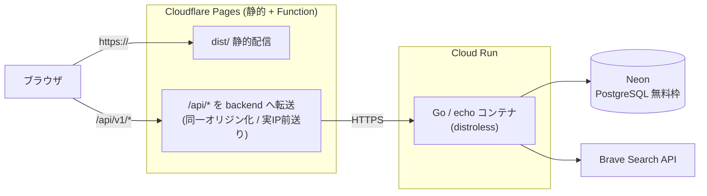

# 本番デプロイ手順（ハイブリッド構成）

MVP を無料枠で本番公開するための手順書。構成は **Cloudflare Pages（フロント＋同一オリジンプロキシ）＋ Cloud Run（Goバックエンド）＋ Neon（Postgres）**。

> 料金・無料枠・各サービスのUIは変わりうる。実施前に各公式ページで最新を確認すること。

## 全体構成



**なぜこの形か**
- フロントの API 呼び出しは相対パス `/api/v1`（`frontend/src/api/client.ts`）。Pages で `/api/*` を backend に転送すれば**ブラウザから見て単一オリジン**になり、`SameSite=Lax` の認証Cookieがそのまま機能する（クロスサイトの `SameSite=None`・CORS・CSRF対策が不要）。
- 既存の本番Dockerfile（`backend`: distroless static）を Cloud Run がそのまま動かせる。DBは `DATABASE_URL` を Neon に差し替えるだけ。
- レート制限は IP 単位。プロキシ配下では実クライアントIPを前送りし、backend 側で信頼して抽出する（[docs: レート制限のプロキシ問題]）。

## 必要なアカウント

| サービス | 用途 | 無料枠の目安 |
| --- | --- | --- |
| Neon | PostgreSQL | 0.5GB / 自動スリープ |
| Google Cloud (Cloud Run + Artifact Registry) | backend 実行・イメージ保管 | Cloud Run は月200万リクエスト等。クレカ登録要 |
| Cloudflare (Pages) | フロント配信・APIプロキシ | 静的は実質無制限 / Functions 10万req/日 |
| Brave Search API | レシピ検索（本番） | 無料プランあり。最初は `stub` でも可 |
| Google Cloud Console (OAuth) | Google ログイン | 無料 |

## 環境変数マトリクス

| 変数 | dev (compose) | prod (Cloud Run) |
| --- | --- | --- |
| `DATABASE_URL` | ローカルPostgres | **Neon の接続文字列**（`sslmode=require`） |
| `JWT_SECRET` | ダミー | **`openssl rand -base64 32` の実値**（Secret Manager 推奨） |
| `SEARCH_API_PROVIDER` | `stub` | `brave`（または当面 `stub`） |
| `SEARCH_API_KEY` | 空 | Brave のキー（`brave` の場合） |
| `FRONTEND_ORIGIN` | `http://localhost:5173` | **Pages のURL**（例 `https://menu-planner.pages.dev`） |
| `GOOGLE_CLIENT_ID` / `_SECRET` | 空可 | 本番のOAuthクライアント |
| `GOOGLE_REDIRECT_URL` | localhost | **`https://<pages>/api/v1/auth/google/callback`**（同一オリジン経由） |
| `AUTH_RATE_LIMIT_PER_MIN` | `0`（無制限） | `10`（spec値） |
| `SEARCH_RATE_LIMIT_PER_MIN` | `0`（無制限） | `60`（spec値） |
| `PORT` | `8080` | Cloud Run が注入（`8080`） |

## 手順

### 1. Neon（DB）
1. Neon でプロジェクトを作成し、接続文字列（`DATABASE_URL`）を控える（`sslmode=require`）。
2. ローカルからマイグレーションと献立マスタを投入する:
   ```bash
   # backend ディレクトリで、Neon の DATABASE_URL を使って実行
   DATABASE_URL="postgres://...neon.../...?sslmode=require" go run ./cmd/migrate up
   DATABASE_URL="postgres://...neon.../...?sslmode=require" go run ./cmd/seed
   ```

### 2. backend（Cloud Run）
1. GCP プロジェクトを作成し、Cloud Run と Artifact Registry を有効化。`gcloud auth login`。
2. 本番イメージをビルドして Cloud Run にデプロイ（`--source` かイメージpush。既存 `backend/Dockerfile` の `prod` ターゲットを使う）。
3. 上表 prod 列の環境変数を設定（機微な値は Secret Manager 経由を推奨）。
4. 割り当てられた URL（`https://menu-planner-backend-xxxx.a.run.app`）を控える。
5. 疎通確認: `curl https://<backend>/health` が 200。

> **コールドスタート**: Cloud Run はゼロスケール、Neon も自動スリープのため、無アクセス後の初回は数秒遅延しうる。気になる場合は Cloud Run の最小インスタンス=1、または backend を Fly.io 常時起動に変更する。

### 3. frontend（Cloudflare Pages ＋ /api プロキシ）
1. Cloudflare Pages プロジェクトを作成し、リポジトリを連携。
   - ビルドコマンド: `npm run build`（`frontend`）／出力: `frontend/dist`
2. `/api/*` を backend に転送する Pages Function を置く（**PR 10-B で追加**）。backend の URL は Pages の環境変数 `BACKEND_ORIGIN` で渡す。
3. デプロイ後の URL（`https://menu-planner.pages.dev`）を控える。

### 4. 認証（Google OAuth）
1. Google Cloud Console でOAuthクライアントを作成/更新。
2. 承認済みリダイレクトURIに **`https://<pages>/api/v1/auth/google/callback`** を追加。
3. `GOOGLE_CLIENT_ID` / `_SECRET` / `_REDIRECT_URL` を Cloud Run に設定。

### 5. 仕上げの相互設定
1. Cloud Run の `FRONTEND_ORIGIN` を Pages の URL に設定して再デプロイ。
2. ブラウザで Pages の URL を開き、サインアップ→検索→履歴→お気に入りを一通り確認。
3. レート制限が実IPで効くこと、認証Cookieが維持されることを確認。

## コード側の対応（別PR）

| PR | 内容 |
| --- | --- |
| 10-B `feat/pages-api-proxy` | Pages Function で `/api/*` を backend に転送。`CF-Connecting-IP` を `X-Forwarded-For` として前送り |
| 10-C `feat/trust-proxy-real-ip` | echo の `IPExtractor` で前送りされた実IPを信頼。本番のレート制限値を有効化 |
| 10-D `feat/prod-hardening` | 本番の CORS / Cookie(Secure) / Google リダイレクトの確認・調整 |
| 10-E（任意）`ci/deploy` | main マージで backend(Cloud Run)・frontend(Pages) を自動デプロイ |

## ロールバック / 注意
- backend は Cloud Run のリビジョンで即ロールバック可能。
- Neon はブランチ/バックアップ機能あり。マイグレーションは `go run ./cmd/migrate down` で1つ戻せる。
- 機微情報（`JWT_SECRET`・`DATABASE_URL`・OAuthシークレット）はリポジトリにコミットしない。`.env` は対象外のまま。
