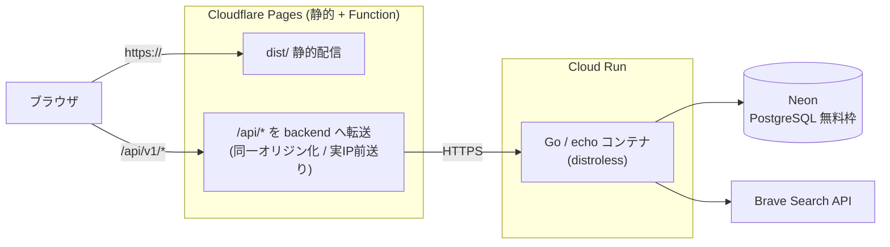

# 本番デプロイ手順（ハイブリッド構成）

MVP を無料枠で本番公開するための手順書。構成は **Cloudflare Pages（フロント＋同一オリジンプロキシ）＋ Cloud Run（Goバックエンド）＋ Neon（Postgres）**。

> 料金・無料枠・各サービスのUIは変わりうる。実施前に各公式ページで最新を確認すること。

## 全体構成



**なぜこの形か**
- フロントの API 呼び出しは相対パス `/api/v1`（`frontend/src/api/client.ts`）。Pages で `/api/*` を backend に転送すれば**ブラウザから見て単一オリジン**になり、`SameSite=Lax` の認証Cookieがそのまま機能する（クロスサイトの `SameSite=None`・CORS・CSRF対策が不要）。
- 既存の本番Dockerfile（`backend`: distroless static）を Cloud Run がそのまま動かせる。DBは `DATABASE_URL` を Neon に差し替えるだけ。
- レート制限は IP 単位。プロキシ配下では実クライアントIPを前送りし、backend 側で信頼して抽出する（[docs: レート制限のプロキシ問題]）。

## 必要なアカウント

| サービス | 用途 | 無料枠の目安 |
| --- | --- | --- |
| Neon | PostgreSQL | 0.5GB / 自動スリープ |
| Google Cloud (Cloud Run + Artifact Registry) | backend 実行・イメージ保管 | Cloud Run は月200万リクエスト等。クレカ登録要 |
| Cloudflare (Pages) | フロント配信・APIプロキシ | 静的は実質無制限 / Functions 10万req/日 |
| Brave Search API | レシピ検索（本番） | 無料プランあり。最初は `stub` でも可 |
| Google Cloud Console (OAuth) | Google ログイン | 無料 |

## 環境変数マトリクス

| 変数 | dev (compose) | prod (Cloud Run) |
| --- | --- | --- |
| `DATABASE_URL` | ローカルPostgres | **Neon の接続文字列**（`sslmode=require`） |
| `JWT_SECRET` | ダミー | **`openssl rand -base64 32` の実値**（Secret Manager 推奨） |
| `SEARCH_API_PROVIDER` | `stub` | `brave`（または当面 `stub`） |
| `SEARCH_API_KEY` | 空 | Brave のキー（`brave` の場合） |
| `FRONTEND_ORIGIN` | `http://localhost:5173` | **公開URL**（`https://kondatekun.yuuyakim.com`） |
| `GOOGLE_CLIENT_ID` / `_SECRET` | 空可 | 本番のOAuthクライアント |
| `GOOGLE_REDIRECT_URL` | localhost | **`https://kondatekun.yuuyakim.com/api/v1/auth/google/callback`**（同一オリジン経由） |
| `AUTH_RATE_LIMIT_PER_MIN` | `0`（無制限） | `10`（spec値） |
| `SEARCH_RATE_LIMIT_PER_MIN` | `0`（無制限） | `60`（spec値） |
| `TRUSTED_PROXY_SECRET` | 未設定 | **Pages と共有する秘密**（`openssl rand -base64 32`） |
| `PORT` | `8080` | Cloud Run が注入（`8080`） |

> **`TRUSTED_PROXY_SECRET` は Cloud Run と Cloudflare Pages の両方に同じ値**を設定する。
> backend はこの秘密が一致したリクエストの `X-Forwarded-For` だけを実クライアントIPとして
> 信頼する。backend のURLは公開されており直接叩けるため、これが無いとIPを詐称するだけで
> レート制限を回避できてしまう。未設定なら転送ヘッダを信頼せず接続元IPを使う（安全側）。

## 手順

### 1. Neon（DB）
1. Neon でプロジェクトを作成し、接続文字列（`DATABASE_URL`）を控える（`sslmode=require`）。
2. ローカルからマイグレーションと献立マスタを投入する:
   ```bash
   # backend ディレクトリで、Neon の DATABASE_URL を使って実行
   DATABASE_URL="postgres://...neon.../...?sslmode=require" go run ./cmd/migrate up
   DATABASE_URL="postgres://...neon.../...?sslmode=require" go run ./cmd/seed
   ```

### 2. backend（Cloud Run）
1. GCP プロジェクトを作成し、Cloud Run と Artifact Registry を有効化。`gcloud auth login`。
2. 本番イメージをビルドして Cloud Run にデプロイ（`--source` かイメージpush。既存 `backend/Dockerfile` の `prod` ターゲットを使う）。
3. 上表 prod 列の環境変数を設定（機微な値は Secret Manager 経由を推奨）。
4. 割り当てられた URL（`https://menu-planner-backend-xxxx.a.run.app`）を控える。
5. 疎通確認: `curl https://<backend>/health` が 200。

> **コールドスタート**: Cloud Run はゼロスケール、Neon も自動スリープのため、無アクセス後の初回は数秒遅延しうる。気になる場合は Cloud Run の最小インスタンス=1、または backend を Fly.io 常時起動に変更する。

### 3. frontend（Cloudflare Pages ＋ /api プロキシ）
1. Cloudflare Pages プロジェクトを作成し、リポジトリを連携。
   - **ルートディレクトリ: `frontend`**／ビルドコマンド: `npm run build`／出力ディレクトリ: `dist`
2. **環境変数を設定**（Cloudflare Pages は Production と Preview で別枠なので Production 側に入れる）:
   - `BACKEND_ORIGIN` … Cloud Run のURL（末尾スラッシュ無し）
     例: `https://menu-planner-backend-537778290491.asia-northeast1.run.app`
   - `TRUSTED_PROXY_SECRET` … Cloud Run に設定したものと**同じ値**
   - `/api/*` を backend に転送する Pages Function は `frontend/functions/api/[[path]].ts` に実装済み（10-B）。
   - この Function が `CF-Connecting-IP` を `X-Forwarded-For` として前送りするため、backend 側でIP単位のレート制限が効く。
3. デプロイ後の URL（`https://<project>.pages.dev`）を控える。カスタムドメインは手順6。
4. 疎通確認: `curl https://<公開URL>/api/v1/menus/suggest` が献立のJSONを返す（＝同一オリジンでAPIが通っている）。

### 4. 認証（Google OAuth）
1. Google Cloud Console でOAuthクライアントを作成/更新。
2. 承認済みリダイレクトURIに **`https://<公開URL>/api/v1/auth/google/callback`** を追加。
3. `GOOGLE_CLIENT_ID` / `_SECRET` / `_REDIRECT_URL` を Cloud Run に設定。

### 5. 仕上げの相互設定
1. Cloud Run の `FRONTEND_ORIGIN` を公開URLに設定して再デプロイ。
2. ブラウザで公開URLを開き、サインアップ→検索→履歴→お気に入りを一通り確認。
3. レート制限が実IPで効くこと、認証Cookieが維持されることを確認。

### 6. カスタムドメイン（`kondatekun.yuuyakim.com`）

`yuuyakim.com` は Cloudflare Registrar で取得した個人ドメイン。献立くんはその**サブドメイン**に載せる。
apex は他の用途のために空けておく。

**先に着手する**: Google の「承認済みドメイン」に `yuuyakim.com` を登録するには、
Google Search Console でのドメイン所有権確認が要る（Cloudflare DNS に TXT を1本）。
ここが通らないと OAuth 同意画面の設定が進まないため、最初に片付ける。

1. Pages プロジェクト → **Custom domains** に `kondatekun.yuuyakim.com` を追加。
   DNS も同じ Cloudflare アカウントにあるため CNAME は自動、証明書発行を数分待つ。
2. Google Cloud Console
   - OAuth 同意画面の承認済みドメインに `yuuyakim.com`
   - 承認済みリダイレクトURIに `https://kondatekun.yuuyakim.com/api/v1/auth/google/callback` を**追加**
     （切り替えが済むまで `pages.dev` の分は消さない）
3. Cloud Run の `FRONTEND_ORIGIN` と `GOOGLE_REDIRECT_URL` を上表の値に更新して再デプロイ。
4. 新URLで通し確認 → 安定後に Google の旧リダイレクトURIを削除。

> **`FRONTEND_ORIGIN` の更新を忘れないこと。** Googleログインの最終リダイレクト先は
> この値（`internal/handler/google.go`）。古いままだとログインは成功するのに
> `pages.dev` へ戻される。以前の「localhost に飛ぶ」不具合と同じ経路。

**HTTPS**: `.com` は `.app` と違い HSTS preload されていない。Cloudflare の SSL/TLS で
**Always Use HTTPS を有効化**する。HSTS を入れる場合、設定はゾーン単位なので
`includeSubDomains` はオフのままにする（`yuuyakim.com` 配下に今後作る全サブドメインが
HTTPS 必須になるため）。Preload は登録すると解除に数ヶ月かかるので押さない。

**Cookie**: 認証Cookieは `Domain` 属性を付けずに発行している（`internal/handler/session.go`）。
host-only なので `kondatekun.yuuyakim.com` のセッションは apex にも他のサブドメインにも
送られない。個人ドメインに別のものを載せても混ざらない。この性質に依存しているので、
`Domain` を足す変更をするときはここを読み直すこと。
なお Cookie はホスト単位のため、`pages.dev` でのログイン状態は新URLに引き継がれない。

## コード側の対応（別PR）

| PR | 内容 |
| --- | --- |
| 10-B `feat/pages-api-proxy` | Pages Function で `/api/*` を backend に転送。`CF-Connecting-IP` を `X-Forwarded-For` として前送り |
| 10-C `feat/trust-proxy-real-ip` | echo の `IPExtractor` で前送りされた実IPを信頼。本番のレート制限値を有効化 |
| 10-D `feat/prod-hardening` | 本番の CORS / Cookie(Secure) / Google リダイレクトの確認・調整 |
| 10-E（任意）`ci/deploy` | main マージで backend(Cloud Run)・frontend(Pages) を自動デプロイ |

## 本番構成（2026-07-21 稼働開始）

| 要素 | 実際の値 |
| --- | --- |
| 公開URL | `https://kondatekun.yuuyakim.com`（Cloudflare Registrar の `yuuyakim.com` のサブドメイン） |
| frontend | Cloudflare Pages（ルート `frontend` / 出力 `dist`、Functions で `/api` を中継） |
| backend | Cloud Run `asia-northeast1`、`min-instances=0` / **`max-instances=2`**（課金の上限） |
| DB | Neon `ap-southeast-1`（Cloud Run は東京のため、DBクエリごとにリージョン間の往復が乗る） |
| レシピ検索 | Brave 実キー |
| 認証 | メール/パスワード ＋ Google SSO |

### 稼働確認の結果

| 検証 | 結果 |
| --- | --- |
| `/api` 同一オリジンプロキシ | JSON応答 ✅ |
| サインアップ→Cookie維持→認証必須API | 201 → 200 → 200 ✅ |
| 未定義パス | 404 ✅ |
| レート制限（検索 60/min） | 12回連続 200 ✅ |
| レート制限（認証 10/min） | 上限で 429 ✅ |
| **IP偽装によるレート制限回避** | **無効化を実証** ✅（毎回違う `X-Forwarded-For` を送っても通算10回で 429） |
| Brave 実キー | cookpad / kurashiru / キッコーマン が3件（約1.1秒） ✅ |
| Google ログイン開始 | 302 → accounts.google.com ✅ |

> **設定の順番に注意**: `TRUSTED_PROXY_SECRET` を Pages と Cloud Run の**両方に設定してから**
> レート制限を有効化すること。先に制限だけ入れると backend が全リクエストを
> 「Cloud Run 入口の単一アドレス」とみなし、全ユーザーが同じ枠を共有して即ブロックされる。

### カスタムドメイン切替後の確認（2026-07-22）

`https://kondatekun.yuuyakim.com` へ切り替えた後、外形から再検証した結果。

| 検証 | 結果 |
| --- | --- |
| DNS | `104.21.91.153` / `172.67.223.116`（Cloudflare）✅ |
| TLS 証明書 | 検証OK ✅ |
| HTTP → HTTPS | 301 ✅（Always Use HTTPS 有効） |
| HSTS | 未設定（方針どおり。入れる場合も `includeSubDomains` はオフ） |
| `/api` 同一オリジンプロキシ | 200 / 献立JSON ✅ |
| `GOOGLE_REDIRECT_URL` | 認可URLの `redirect_uri` が本番ドメイン ✅ |
| `FRONTEND_ORIGIN` | 本番オリジンのみ CORS 許可、他は拒否 ✅ |
| レート制限（検索 60/min） | 65回中 60×200 → 5×429 ✅ |
| レート制限（認証 10/min） | 13回中 10×401 → 3×429 ✅ |
| IP偽装によるレート制限回避 | **無効化を再実証** ✅（下記） |
| 本番 Google ログイン（実機） | 成功 ✅ |

**IP偽装の再実証**: 公開ドメイン経由ではクライアントが送った `X-Forwarded-For` を
Pages Function が上書きするため、偽装しても 429 のまま。Cloud Run を直叩きした場合も、
共有シークレットを伴わない `X-Forwarded-For` は信頼されず接続元IPで計数されるため、
偽装値を変えても同じバケツのまま 429 になる。

> **外形からは検証できない点**: 「異なる実クライアントIPが別枠で数えられる」ことは
> 単一の送信元からは確かめられない。上記が示すのは「詐称で枠を増やせない」ことまで。

## ロールバック / 注意
- backend は Cloud Run のリビジョンで即ロールバック可能。
- Neon はブランチ/バックアップ機能あり。マイグレーションは `go run ./cmd/migrate down` で1つ戻せる。
- 機微情報（`JWT_SECRET`・`DATABASE_URL`・OAuthシークレット）はリポジトリにコミットしない。`.env` は対象外のまま。
