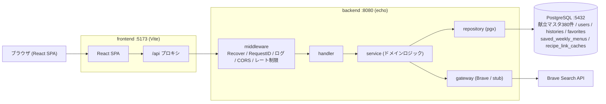

# 献立くん (menu-planner)

**種類（主菜／副菜／汁物）×ジャンル×難易度**で夕食の献立を提案し、
レシピサイトへのリンクを3件開ける Web アプリ。
週間献立の提案と**その保存**、**必要な食材の表示と買い物リスト**、
**冷蔵庫にある食材からの献立検索**、検索履歴、お気に入り、
メール/パスワード・Google の認証に対応する。

**本番: https://kondatekun.yuuyakim.com**
（Cloudflare Pages ＋ Cloud Run ＋ Neon。構成と手順は [`DEPLOY.md`](./DEPLOY.md)）

仕様の正は [`spec.md`](./spec.md)。実装の進め方は [`task.md`](./task.md)。

## 技術スタック

| 層 | 採用 |
| --- | --- |
| バックエンド | Go 1.26 / echo v4 / pgx v5 / golang-jwt v5 / golang-migrate v4 |
| フロントエンド | React 19 / TypeScript / Vite / React Router 7 / TanStack Query 5 / Tailwind CSS 4 |
| データベース | PostgreSQL 17 |
| レシピ検索 | Brave Search API（`stub` に差し替え可能） |
| テスト | Go標準 + testcontainers / Vitest + Testing Library + MSW / Playwright (E2E) |
| 実行環境 | Docker Compose |

## アーキテクチャ



- **レイヤードアーキテクチャ**: handler → service → repository / gateway。依存は内向き（service はインフラの具体を知らず、`ports.go` のインターフェースにのみ依存）。
- **フロントは同一オリジン**: Vite dev server が `/api` を backend に転送するため、ブラウザから見て同一オリジンになる。
- **食材は自前のマスタで持つ**（[spec.md 14章](./spec.md)）。レシピをクロールしない判断のため外部から取得できず、
  自前の献立マスタと同様に自前で持つ。調味料は含めず、分量も持たない（買い物リストは食材名のチェックリスト）。
  代表的な食材の例であり、**アレルギー対応とは位置づけない**。
- **手持ちの食材から献立を探せる**（[spec.md 2.9](./spec.md)）。**既定では**完全一致に絞らず、
  各候補に不足食材を示す。献立1件の食材は平均4.4種で、それを全部持っている状況はまれなため、
  絞ると候補がほぼ0件になる（実データで確認済み）。「あと2品買えば作れる」が買い物の判断に効く。
  **「探し方」で「この中だけで作れるもの」にも絞れる**（不足のある献立を出さない）。
  「冷蔵庫にあるものを全部チェックする」使い方なら成立し、0件になったときは0件と明言した上で
  「あと1品買えば作れます」候補を別枠で出す。**「並び順」**は既定が「買い足しが少ない順」で、
  余らせず使い切りたいときは「手持ちを多く使う順」に切り替えられる（「この中だけで作れるもの」を
  選んでいる間は不足が必ず0のため並び順は意味を持たず、つまみごと隠す）。上位20件まで。
  入力はマスタからの選択にしている（自前マスタなので自由入力だと表記揺れの吸収が必要になり、
  一致しない理由を説明できない）。
- **週間献立は保存できる**（`saved_weekly_menus`、1ユーザー50件まで）。作業中の週は sessionStorage に持つが、
  買い物の場で見返すには端末やセッションをまたぐ必要があるためサーバにも置く（[spec.md 2.8](./spec.md)）。
  上限に達したら古いものを押し出さず 409 で断る。保存は明示的な操作なので、黙って消えると行為の意味が壊れる。
- **献立は役割（主菜／副菜／汁物）で絞り込める**（[spec.md 2.10](./spec.md)）。動機は引き直しコストで、
  晩ごはんを決めようとしてカプレーゼやコーンスープが単品で出ると、それだけでは夕食にならず必ず引き直しになる。
  **未指定の既定は「主菜」**で、ジャンル・難易度（未指定＝すべて）と意味が違う。
  未指定のときに一番起きてほしくないのが副菜の単品提案なので安全側に倒している。`all` を明示すれば全部から引ける。
  お弁当のように副菜を多く使う人は `side` を選んで繰り返し引ける。
  **1食を「主菜＋副菜の組」にはしていない。** 献立の粒度を組に変えると、履歴・お気に入り・週間献立の保存・
  買い物リストの「1件＝1献立」がすべて崩れるため、絞り込みの軸を1本足すに留めた。
- **レシピリンクはキャッシュ**する（`recipe_link_caches`、TTL 7日）。献立はマスタの件数だけで増えないため、外部APIの消費は献立数（現在380件）で頭打ちになる（[spec.md 13.2](./spec.md)）。

## クイックスタート

Docker と Docker Compose、GNU Make が必要。

```bash
cd menu-planner
cp .env.example .env      # 既定は SEARCH_API_PROVIDER=stub。APIキー無しで全機能が動く
make up                   # コンテナ起動（db / backend / frontend）
make migrate              # マイグレーション適用
make seed                 # 献立マスタ380件を投入
# → http://localhost:5173 を開く
```

停止は `make down`、コンテナとデータの完全削除は `make clean`。

`make help` で全ターゲットを一覧できる（主なもの: `up` / `down` / `logs` / `migrate` / `seed` / `test` / `lint` / `build` / `health`）。

## 環境変数

`.env.example` をコピーして `.env` を作る。`.env` はコミットしない。

| 変数 | 用途 | 既定 / 例 |
| --- | --- | --- |
| `DATABASE_URL` | Postgres 接続文字列 | `postgres://app:password@db:5432/menu_planner?sslmode=disable` |
| `JWT_SECRET` | JWT 署名鍵。**本番は `openssl rand -base64 32` で生成** | （開発用のダミー） |
| `SEARCH_API_PROVIDER` | レシピ検索の実装 | `brave` \| `stub` |
| `SEARCH_API_KEY` | Brave Search API キー（`stub` なら空でよい） | — |
| `INGREDIENT_RESOLVER_PROVIDER` | 手持ちの食材テキストの解決（表記揺れ吸収）の実装。**空だと起動に失敗** | `claude` \| `stub` |
| `INGREDIENT_RESOLVER_API_KEY` | Anthropic のキー（`stub` なら空でよい） | — |
| `FRONTEND_ORIGIN` | CORS で許可する唯一のオリジン | `http://localhost:5173` |
| `GOOGLE_CLIENT_ID` / `_SECRET` / `_REDIRECT_URL` | Google SSO（空でもメール認証は動く） | — |
| `AUTH_RATE_LIMIT_PER_MIN` | 認証エンドポイントの上限（IP/分、0で無制限） | 本番 `10` / compose `0` |
| `SEARCH_RATE_LIMIT_PER_MIN` | 検索エンドポイントの上限（IP/分、0で無制限） | 本番 `60` / compose `0` |

> **レート制限を compose で 0（無制限）にしている理由**: Vite プロキシ配下では全リクエストが
> プロキシの単一IPに集約され、正当な操作でも即座に上限へ達してしまう。本番は実クライアントIPが
> 分かる構成で spec 値（認証10 / 検索60）を設定する。

## 開発

```bash
make test            # backend(Go) + frontend(型/Lint/テスト)
make test-backend    # go test ./... -cover
make test-frontend   # tsc -b / oxlint / vitest
make test-e2e        # Playwright（事前に make up と make seed が必要）
make lint            # go vet / golangci-lint / oxlint
make gen-api         # api/openapi.yaml から TS の型を再生成
```

- **API 仕様の正は [`api/openapi.yaml`](./api/openapi.yaml)**。変更したら `make gen-api` で型を再生成してコミットする（CIが差分で落とす）。
- Go 実装と仕様のズレは契約テスト（`internal/handler/contract_test.go`）が検出する。
- ローカルの `go test` は `-race` を使わない（cgo=gcc が必要なため）。CI の Linux 上では有効。

## 性能

非機能要件の目標は「検索 p95 200ms以内」（[spec.md 11章](./spec.md)）。`stub` プロバイダ・シード済みDBの
ローカル環境（docker compose）で、backend（`localhost:8080`）へ逐次 curl した実測値:

| エンドポイント | p50 | p95 | p99 | 目標 |
| --- | --- | --- | --- | --- |
| `GET /menus/suggest`（検索） | 2.7ms | **3.0ms** | 11.6ms | 200ms |
| `GET /menus/:id`（詳細） | 2.7ms | 3.0ms | 3.2ms | — |
| `POST /menus/suggest-weekly`（週間） | 3.0ms | 3.6ms | 3.8ms | — |

いずれもDBのみで完結し外部APIを叩かないため、目標を大きく下回る。レシピ取得（`GET /menus/:id/recipes`）は
外部API依存のため別目標（p95 2s）で、キャッシュヒット時は数ms（[spec.md 11章 / task.md 3-G](./task.md)）。

## ディレクトリ構成

```
menu-planner/
├── backend/
│   ├── cmd/            # server / migrate / seed のエントリポイント
│   ├── internal/
│   │   ├── handler/    # HTTPハンドラ・ミドルウェア（CORS/ログ/レート制限）
│   │   ├── service/    # ドメインロジック（献立選定・重複回避・履歴・認証）
│   │   ├── repository/ # データアクセス（pgx）
│   │   ├── gateway/    # 外部レシピ検索API（brave / stub）
│   │   ├── domain/     # エンティティ・値オブジェクト
│   │   ├── auth/       # パスワードハッシュ・JWT・Google OAuth
│   │   └── logctx/     # request_id 付き logger の受け渡し
│   └── db/             # migrations / seeds（embed.FS で埋め込み）
├── frontend/
│   ├── src/
│   │   ├── features/   # menu / auth / history / favorite
│   │   ├── components/ # 共通UI（ErrorBoundary / NotFoundPage ほか）
│   │   ├── api/        # 生成された型 + fetch クライアント
│   │   └── app/        # ルーティング・プロバイダ
│   └── e2e/            # Playwright
├── api/openapi.yaml    # API 仕様（正）
├── docker-compose.yml
├── Makefile
├── spec.md             # 仕様（正）
└── task.md             # 実装フェーズと進捗
```

## MVP 対象外

アレルギー除外、朝昼の献立、献立のユーザー投稿、栄養価計算（[spec.md 1.2](./spec.md)）。
本番デプロイ（フェーズ10）・買い物リスト（フェーズ11）・週間献立の保存（フェーズ12）・
手持ち食材からの検索（フェーズ13）・献立の役割（フェーズ14）は対応済み。

利用者レビューから積んだ後続タスク（献立の日常性による出し分け、季節・旬ほか）は
[`task.md`](./task.md) の「利用者レビューからの後続タスク」に整理してある。
**次は「日常性（庶民的かどうか）を難易度から分離する」**（`elaborate` に
「手間はかかるが日常の料理」「ハレの日」「家庭で作るものではない」が混在している問題）。
